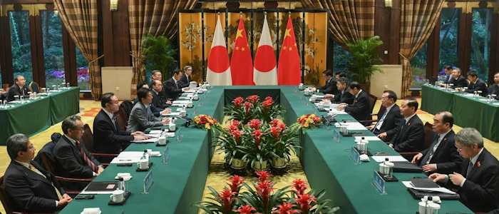

# Бангкокский мирный договор
Противостояние блоков Китая и Японии было завершено в 2027 году во время второго раунда переговоров тайландском городе Бангкок. Был подписан мирный договор, завершивший [Азиатский театр](https://docs.arussianday.ru/story/ww3/asian-front.html#азиатскии-фронт) боевых действий Третьей Мировой войны.

## Пункты договора

- Китай признаётся полноправным владельцем Тайваня. Тайваньское правительство в изгнании расформировано.
  
- Корейский полуостров объединяется под властью КНДР.
  
- Японское переходное правительство получает полномочия управления страной. Япония вступает в [АТП](https://docs.arussianday.ru/story/third-chapter.html#глава-iii-начало-конца)
  

