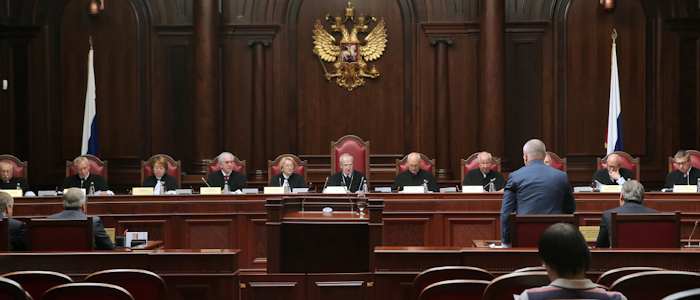

# Новгородский процесс

Одним из пунктов [Владивостокского мирного договора](https://docs.arussianday.ru/story/conflicts/vladivostok_peace_treaty/vladivostok_peace_treaty.html) была выдача всех подозреваемых в террористических атаках на территории России. Страны НАТО были вынуждены предоставить всех требуемых лиц, укрывавшихся на их территории. Те были доставлены в Новгород, где должны были предстать перед судом в дворце правосудия.

**Первый новгородский процесс**

На скамье подсудимых оказалось 20 граждан Польши, Германии и мигрантов из Украины, причастных к подрыву газотранспортных потков России в 2024 году.

> Федеральной службой безопасности Российской Федеративной Империи в ходе совместной работы с СК Российской Федерации сформирована неопровержимая доказательная база участия в данном преступлении граждан ... *полный список осужденных* ... не понесших за это уголовного наказания

Подрыв потоков был расценен как террористический акт, в том числе международного масштаба (ст. 205 и 361) и диверсия (ст. 281). 
Несмотря на попытки нового правительства Германии сгладить углы и попробовать догвориться о возвращении её граждан и проведении суда уже в Берлине, все присутствующие на скамье подсудимых получили наказание в виде пожизненного заключения. 

**Второй новгородский процесс**

На скамье подсудимых оказалось 30 граждан Франции, Германии и Бельгии (теперешнего Бенилюкса), курировавших дестабилизацию ситуации в Малороссии и Новроссии, покушения на высокопоставленных чиновников.

*Процесс закончится в начале 2030 года, и на его итоги сможет повлиять сам игрок*

