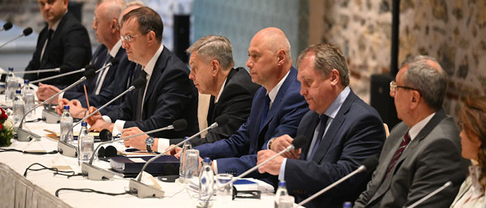

# Владивостокский мирный договор
В 2028 году в российском городе Владивосток представители всех стран-участников Третьей Мировой войны подписали ряд документов, именованых "Владивостокский Мирный договор". Он знаменовал окончание войны и становление многополярного мира. 

## Пункты договора

- Польша становится автономным регионом России;

- Новообразованные республики Кашубия и Силезия являются нейтральными государствами, независимость которых гарантируется Россией;

- Словакия, Румыния и Венгрия выходят из ЕС и НАТО;

- [Лос-Анджелес](https://docs.arussianday.ru/story/countries/rzvl/rzvl.html) переходит под контроль России в качестве гаранта безопасности тихоокеанском регионе;

- Стороны конфликта по-прежнему обязаны соблюдать Договор о нераспространении ядерного оружия;

- Европа обязана выполнить требование России, выдвинутое в ООН в 2024 году, согласно которому она должна выдать всех участников военных преступлений на территории России.

## Берлинский пакт (Berliner Pakt)

Отдельным документом принимался договор о признании Временного правительства Германии легитимным. Это позволило революционерам сохранить власть, исключить претензии соседей и заполучить международное признание.

