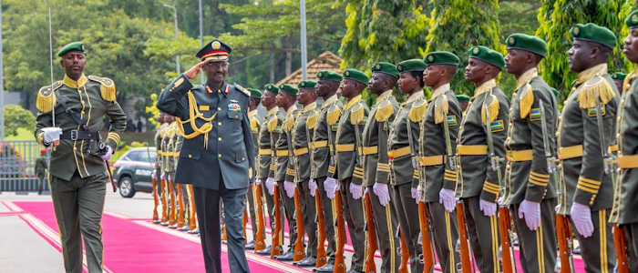
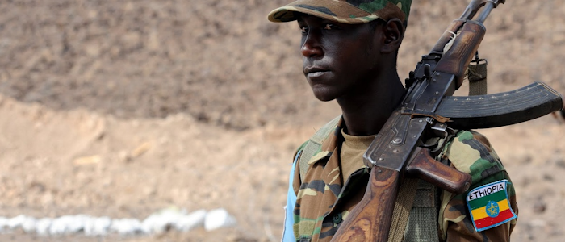

# Эфиопия

**Социалистический переворот**

В 20-е года XXI века антиамериканские и антиевропейские движения в африканских странах усилились. В Эфиопии власть удалось захватить радикальной хунте во главе с Бирхану Джулой. Позже было подтверждено, что их экономика и политические решения сильно зависят от Китая. "Большой брат" начал вкладывать большие деньги в дорогостоящий проект плотины на Ниле взамен на верность режима Бирхану.

**Коммунистический Альянс Африки**

Помимо Эфиопии перевороты крайне левых происходили и в дркгих странах восточной Африки. Чтобы укрепить власть и не допустить вторжение, диктаторские режимы во главе с Эфиопией основали Коммунистический Альянс Африки (CAA).
Общими усилиями спонсировались перевороты в соседних странах, что усиливало влияние альянса на континенте.

**Вторая Тыграйская война и аннексия Эритери**

В 2026 году ополченцы Тыграя воспользовались внутренней нестабильностью страны и попытались вернуть себе власть в регионе, но вскоре были подавлены так же, как и в 2022 году.

Всё это время Бирхану Джула выстраивал позитивные отношения со своими соседями, особенно с Эритреей. Он считал её исторической территорией Эфиопии и подчёркивал необходимость её возвращения в состав Эфиопии. В 2028 году Эритрея была аннексирована под давлением Эфиопии.

**Конфликт с ДР Конго**

На другой стороне Африки развивалась другая сила - Панафриканский союз (PAU), возглавляемый Демократической Республикой Конго. Он активно поддерживался европейскими странами и был настроен не признавать радикальную политику Эфиопии и её союзников. Отношения значительно ухудшились после аннексии Эритреи, и дипломатия между альянсами была полностью приостановлена. Ситуация обострялась с каждым годом и грозила одной из крупнейших войн в истории Африки.

