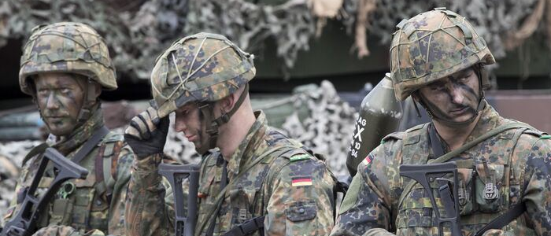
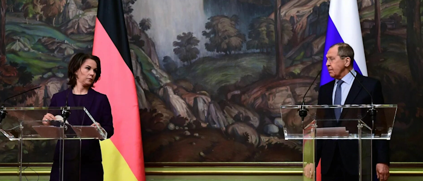
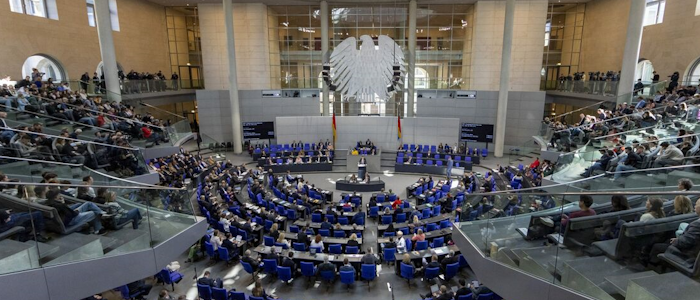

# Германская Республика

## Специальная Военная Операция

Февраль и все последующие события сильно подкосили Европейский Союз. Невыполнимые для многих стран пакеты санкций, сепаратизм на национальном уровне, политические и экономические разногласия создают идеальную почву для прорастания евроскептицизма — людям тяжело поддерживать союз, когда у них дома нет газа.  

Германия столкнулась с первыми серьезными проблемами уже совсем скоро после начала СВО: увеличение госдолга, массовые волны беженцев из Украины и Ближнего Востока, подорожание нефти и газа, многие социальные вопросы. Правящая «Светофорная Коалиция» подвергалась массовой критике из-за усугубления ситуации и радикальной анти-российской политики. 

На фоне недовольства граждан начала набирать популярность правая популистская партия «Альтернатива для Германии», выступающая за восстановление отношений с Россией, отстранение от Евросоюза (так называемые евроскептики), социальные реформы, резкое отношение в сторону иммиграции и климатических инициатив; а также CDU / CSU (Христанские демократы), ведущие схожую политику в право-центральном спектре. 

Военная поддержка Украины не привела к серьезным результатам: европейская экономика не успела наладить массовые и бесперебойные поставки оружия, а после падения Киева конец войны стал очевиден всем. Зимой 2023 года Украина подписала безоговорочную капитуляцию. Для Германии это выльется в новую массовую волну беженцев, потерю сотен единиц вооружения (которые после будут использованы против них же), а также в большую нагрузку на бюджет 2022-2023 годов, которую придется компенсировать долгами и кредитами. 

В ноябре произошел политический скандал вызванный незаконным перераспределением бюджета, перенаправив неизрасходованный бюджет для борьбы с COVID-19 на борьбу с климатом: это вызовет крупные фермерские протесты, снижение рейтингов «Зелёных» и станет первым предвестником будущего кризиса.

## Кризис правительства 
После победы России, Германия оказалась в подвешенном энергетическом состоянии: Россия диктует свои условия за газ и нефть, Американский СПГ дорог и сложен в использовании, а китайские рынки закрываются из-за американо-китайской напряженности. 

В этот момент напряжение и разногласия между партиями выросли настолько, что «Светофор» начал откровенно трещать по швам. СДПГ, СвДП и Союз 90 не могут договориться о решении важных проблем, откровенно саботируют проекты друг друга из-за радикально разных взглядов на политику, а доверие населения к правительству падает до исторических минимумов. 

В январе Зелёные настаивают на ускоренном отказе от угля и атома, но промышленники и профсоюзы требуют «энергетического перемирия» с Россией. 

В апреле на фоне экономического кризиса проходит серия «тракторных маршей», участие в которых принимают крестьяне и промышленники. 

В июне СДПГ полностью блокирует все экологические проекты Зелёных в рамках программы сокращения расходов, однако позже, после волны протестов и давления со стороны Союза 90, это решение отменяется. 

В сентябре на региональных выборах в нескольких землях «Светофор» проигрывает ХДС и АдГ. 

В октябре и ноябре происходит серия дебатов по вопросу будущей экономической политики коалиции. Линднер, лидер СвДП, разработал новую экономическую политику, но она подразумевала увеличение государственного долга и сокращение инвестирования инициатив Зелёных и СДПГ, из-за чего была отвергнута. 

Критической точкой в конфликте стало прошение Олафа Шольца президенту Германии Штайнмаеру о снятии с должности министра финансов Линднера. Но президент не стал увольнять министра, чтобы не допустить развал «Светофорной коалиции» и больший кризис для ФРГ. 

«Светофор» стал «зомби-коалицией»: формально коалиция оставалась правящей, но фактически не могла вести эффективную политику из-за внутреннего кризиса и потери множества земель в сентябре. 

## Партии

Кризисом в правительстве воспользовались малочисленные [партии](https://docs.arussianday.ru/story/conflicts/germany/parties.html) вроде АдГ и КЛС. Раннее малочисленные и слабые партии получили влияние на действия правительства в Германии. 

КЛС (Коалиция левых сил) является союзом всех коммунистов, основанная в приблизительно 2015-м году, её существование обусловлены созданием коалиции Светофор. Эта коалиция же является объединением таких популярных партий как КПГ, Левые и МЛПГ. Их цель была занять лидирующее место среди всех партий. Однако этого им не удалось из-за тайных попыток удержать власть коалицией «Светофор».

АдГ было создано в 2013-м году как оппозиция власти с уклоном в правый популизм, на протяжении всей истории партия сталкивалась с недопониманием от населения, считавшего партию ультраправыми. Однако после распада коалиции «Светофор», партия смога подняться вверх по рейтингам сместив СвДП и Зелёных. 

Кроме того постоянные попытки ухватиться за рейтинги оканчивались возможными случайными смертями кандидатов партий АдГ и КЛС, которые по некоторым мнениям являлись заказными от правящей партии, это и стало причиной их тотальной оппозиционности и объединения против коалиции «Светофор». В стране установился союз между АдГ и КЛС против ХДС.

## Третья мировая война

К апрелю 2025 года, когда началась Третья мировая война, Германия была плохо подготовлена к боевым действиям. У страны было некоторое время на укрепление, поскольку российская армия увязла в боях за ряд польских городов. Однако Германия была охвачена внутренними проблемами: бюрократия НАТО и ЕС была неэффективна в военное время, немецкий народ яростно сопротивлялся мобилизации, а антиправительственные настроения стремительно росли.

### Законопроект о всеобщей мобилизации

В мае 2025 года, в бундестаге был опубликован законопроект о всеобщей мобилизации на время войны против МПТ, этот проект был поддержан CDU и коалицией Светофора, из за чего и было набрано большинство голосов ЗА, однако союз АдГ и КЛС не согласились с данным решением и тайно организовали партизанское движение партизан помогающих мобилизованным сбежать, но у таких спасавшихся оставался только один выбор - это идти к партизанам и спасать таких же немцев в опасности.

Решение нехваток резервов у армии решалось крайне радикально, людей ловили на улице и отправляли на фронт, создавались военные коммисариаты занимавшихся более эффективным отловом людей. К счастью большинство из мобилизованных спасались на пол пути к фронту, благодаря партизанам АдГ и КЛС.

После капитуляции Берлина терпение народа лопнуло. Оппозиционные партии уже давно готовили антиправительственные действия и получили "зелёный свет". По всей стране вспыхнули восстания против правящей партии. Фридрих Мерц не ушёл в отставку, а призвал бороться до конца и вступать в ополчение. Однако у правительства небыло сил и оно быстро пало.
Революция в Германии стала одним из поворотных моментов Третьей мировой войны. 

## Революция и выход из войны

Конец войне в Германии положил Петербургский мирный договор 20 июня 2028 года. Новое правительство заключило сепаратный мир с РФ, где народ Германии смог отстоять свою честь и почти не понёс сильных экономических и политических потерь. Его условиями стало:

- Военные репарации со стороны Германии на восстановление городов Польши, а также организация добровольческих строительных бригад для отправки в Польшу.
- Восстановление торговых путей между двумя странами и взаимное снятие санкций.
- Германия поддержит Россию на будущих мирных переговоров между НАТО и МПТ.

Мирный договор был смягчён из-за крайне плачевной ситуации в экономике Германии - большинство производящих компаний покинуло страну ещё во время войны. Также смягчающим фактором стали пророссийские настроения в правительстве и народе.
Выход Германии из войны вскоре склонил всех оставшихся членов НАТО к [мирному договору](https://docs.arussianday.ru/story/conflicts/vladivostok_peace_treaty/vladivostok_peace_treaty.html) с Россией. Во Владивостоке также был подписан Берлинский Пакт, по которому немецкое Временное правительство признавалось всеми странами.

## Период двухпартийного правительства

После войны в Германской Республике сложилась уникальная система государственного управления: две партии, Альтернатива для Германии (АдГ / AfD) и Коалиция Левых Сил (КЛС / KLK), управляли страной на равных. Их лидеры сыграли важную роль в немецкой революции и договорились работать вместе до выборов 2031 года.

