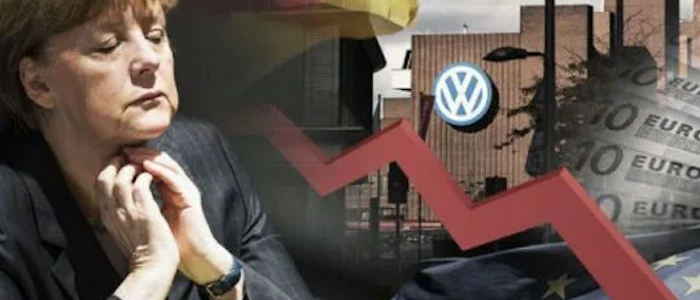
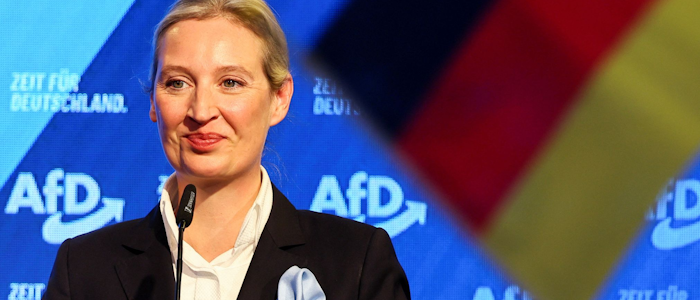

# Германская Республика

## Война на Украине

Февраль и все последующие события сильно подкосили Европейский Союз. Невыполнимые для многих стран пакеты санкций, сепаратизм на национальном уровне, политические и экономические разногласия создают идеальную почву для роста евроскептицизма — людям тяжело поддерживать союз, когда у них дома нет газа.

Германия столкнулась с первыми серьёзными проблемами уже совсем скоро после начала СВО: увеличение госдолга, массовые волны беженцев из Украины и Ближнего Востока, подорожание нефти и газа, обострение социальных вопросов. Правящая «Светофорная коалиция» подвергалась массовой критике из-за усугубления ситуации и радикальной антироссийской политики.

На фоне недовольства граждан начала набирать популярность правая популистская партия «Альтернатива для Германии», выступающая за восстановление отношений с Россией, отстранение от Евросоюза (так называемые евроскептики), социальные реформы, жёсткую иммиграционную политику и умеренные климатические инициативы; а также CDU/CSU (Христианские демократы), ведущие схожую политику в право-центральном спектре.

Военная поддержка Украины не привела к серьёзным результатам: европейская экономика не успела наладить массовые и бесперебойные поставки оружия, а после падения Киева конец войны стал очевиден всем. Зимой 2023 года Украина подписала безоговорочную капитуляцию. Для Германии это выльется в новую массовую волну беженцев, потерю сотен единиц вооружения (которые позже будут использованы против неё же), а также в большую нагрузку на бюджет 2022–2023 годов, которую придётся компенсировать долгами и кредитами.

В ноябре произошёл политический скандал, вызванный незаконным перераспределением бюджета: неизрасходованные средства на борьбу с COVID-19 были перенаправлены на климатические проекты. Это вызвало крупные фермерские протесты, снижение рейтингов «Зелёных» и стало первым предвестником будущего кризиса.

## Кризис правительства

После победы России Германия оказалась в подвешенном энергетическом состоянии: Россия диктует свои условия по газу и нефти, американский СПГ дорог и сложен в использовании, а китайские рынки закрываются из-за американо-китайской напряжённости.

В этот момент напряжение и разногласия между партиями выросли настолько, что «Светофор» начал откровенно трещать по швам. СДПГ, СвДП и Союз 90 не могут договориться о решении важных проблем, откровенно саботируют проекты друг друга из-за радикально разных взглядов на политику, а доверие населения к правительству падает до исторических минимумов.

В январе Зелёные настаивают на ускоренном отказе от угля и атома, но промышленники и профсоюзы требуют «энергетического перемирия» с Россией.

В апреле на фоне экономического кризиса проходит серия «тракторных маршей», в которых участвуют крестьяне и промышленники.

В июне СДПГ полностью блокирует все экологические проекты Зелёных в рамках программы сокращения расходов, однако позже, после волны протестов и давления со стороны Союза 90, это решение отменяется.

В сентябре на региональных выборах в нескольких землях «Светофор» проигрывает ХДС и АдГ.

В октябре и ноябре проходит серия дебатов по вопросу будущей экономической политики коалиции. Линднер, лидер СвДП, разработал новую экономическую политику, которая подразумевала увеличение государственного долга и сокращение инвестиций в инициативы Зелёных и СДПГ, из-за чего была отвергнута.

Критической точкой в конфликте стало прошение Олафа Шольца президенту Германии Штайнмаеру о снятии с должности министра финансов Линднера. Но президент не стал увольнять министра, чтобы не допустить развала «Светофорной коалиции» и ещё большего кризиса для ФРГ.

«Светофор» стал «зомби-коалицией»: формально коалиция оставалась правящей, но фактически не могла вести эффективную политику из-за внутреннего кризиса и потери множества земель в сентябре.

## Партии

Кризисом в правительстве воспользовались малочисленные [партии](https://docs.arussianday.ru/story/countries/germany/parties.html), такие как АдГ и КЛС. Ранее малочисленные и слабые партии получили влияние на действия правительства в Германии.

КЛС (Коалиция левых сил) — союз всех коммунистов, основанный примерно в 2015 году; её существование было обусловлено созданием коалиции «Светофор». Эта коалиция объединяла такие партии, как КПГ, «Левые» и МЛПГ. Их цель заключалась в занятии лидирующих позиций среди всех партий, однако этого им не удалось из-за тайных попыток удержать власть коалицией «Светофор».

АдГ была создана в 2013 году как оппозиция с уклоном в правый популизм. На протяжении всей истории партия сталкивалась с недопониманием населения, считавшего её ультраправой. Однако после распада коалиции «Светофор» партия смогла подняться в рейтингах, сместив СвДП и «Зелёных».

Постоянные попытки «ухватиться» за рейтинги иногда заканчивались возможными случайными смертями кандидатов АдГ и КЛС, которые, по мнению некоторых, были заказными со стороны правящей коалиции. Это усилило их оппозиционность и привело к объединению против «Светофора». В стране установился союз между АдГ и КЛС против ХДС и «Светофора», который позже назвали Патриотическим фронтом Германии.

## Третья мировая война

К апрелю 2025 года, когда началась Третья мировая война, Германия была плохо подготовлена к боевым действиям. У страны было некоторое время на укрепление, поскольку российская армия увязла в боях за ряд польских городов. Однако Германия была охвачена внутренними проблемами: бюрократия НАТО и ЕС оказалась неэффективной в военное время, немецкий народ яростно сопротивлялся мобилизации, а антиправительственные настроения стремительно росли.

### Законопроект о всеобщей мобилизации

В мае 2025 года в Бундестаге был опубликован законопроект о всеобщей мобилизации на время войны против МПТ. Этот проект был создан партией CDU при поддержке коалиции «Светофор», из-за чего было набрано большинство голосов «за». Однако союз АдГ и КЛС не согласился с решением и тайно организовал партизанское движение, помогавшее мобилизованным сбежать. Тем, кто спасался, оставался лишь один путь — идти к партизанам и помогать другим немцам в опасности.

Недостаток резервов армии решался крайне радикально: людей ловили на улице и отправляли на фронт, создавались военные комиссариаты для более эффективного отлова. К счастью, большинство мобилизованных спасалось на полпути к фронту благодаря партизанам АдГ и КЛС.

После капитуляции Берлина терпение народа лопнуло. Оппозиционные партии уже давно готовили антиправительственные действия и получили «зелёный свет». По всей стране вспыхнули восстания против правящей коалиции. Фридрих Мерц не ушёл в отставку и призвал бороться до конца и вступать в ополчение. Однако у правительства не было сил, и оно быстро пало. Революция в Германии стала одним из поворотных моментов Третьей мировой войны.

## Революция и выход из войны

Конец войны в Германии положил Петербургский мирный договор 20 июня 2028 года. Новое правительство заключило сепаратный мир с РФ, где народ Германии смог отстоять свою честь и почти не понёс сильных экономических и политических потерь. Его условия:

* Военные репарации со стороны Германии на восстановление городов Польши, а также организация добровольческих строительных бригад для отправки в Польшу.
* Восстановление торговых путей между двумя странами и взаимное снятие санкций.
* Германия поддержит Россию на будущих мирных переговорах между НАТО и МПТ.

Мирный договор был смягчён из-за крайне плачевной экономической ситуации: большинство производящих компаний покинуло страну ещё во время войны. Также смягчающим фактором стали пророссийские настроения в правительстве и среди населения. Выход Германии из войны вскоре подтолкнул всех оставшихся членов НАТО к [мирному договору](https://docs.arussianday.ru/story/conflicts/vladivostok_peace_treaty/vladivostok_peace_treaty.html) с Россией. Во Владивостоке также был подписан Берлинский пакт, по которому немецкое временное правительство признавалось всеми странами.

## Период двухпартийного правительства

После войны в Германской Республике сложилась уникальная система государственного управления: две партии, Альтернатива для Германии (АдГ / AfD) и Коалиция Левых Сил (КЛС / KLK), управляли страной на равных. Их лидеры сыграли важную роль в немецкой революции и договорились работать вместе до выборов 2031 года.

