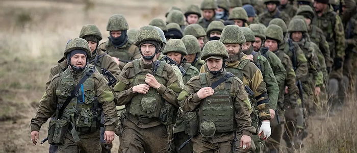
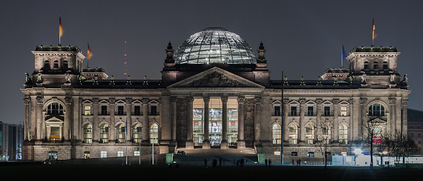

# Партии

Кризисом в правительстве воспользовались ранее малочисленные и маргинальные политические силы. В условиях падения доверия к традиционным партиям именно они смогли предложить альтернативные проекты будущего Германии. Наиболее значимыми стали Альтернатива для Германии (AfD) и Коалиция левых сил (KLK), которые со временем сформировали временный политический союз против правящей системы.

## Коалиция «Светофор» (SPD — FDP — Die Grünen)

Коалиция «Светофор» возникла после выборов 2021 года, когда ни одна партия не получила большинства в Бундестаге. SPD заняла первое место, но без поддержки FDP и Die Grünen не могла сформировать правительство. Переговоры привели к созданию компромиссной коалиции под руководством канцлера Олафа Шольца.

Изначально «Светофор» позиционировался как умеренная сила, способная продвигать демократию, зелёный энергетический переход и сохранение интеграции в ЕС и НАТО. В экономике коалиция пыталась балансировать между поддержкой бизнеса и социальной защитой граждан, но различия между партиями часто приводили к внутренним конфликтам.

С началом СВО коалиция приняла жёсткую внешнеполитическую линию, оказывая поддержку Украине. Одновременно правительство пыталось удерживать социальную стабильность внутри страны, однако рост цен на энергоносители, волны беженцев и бюджетный дефицит усилили недовольство граждан.

Внутренние противоречия нарастали: FDP выступала против увеличения госдолга, SPD требовала расширения социальных программ, а Die Grünen настаивали на ускоренном отказе от ископаемого топлива. Эти разногласия делали управление страной всё более сложным и непоследовательным.

### Политика в период кризиса

С началом СВО коалиция сделала ставку на жёсткую внешнеполитическую линию и поддержку Украины, одновременно пытаясь удержать социальную стабильность внутри страны.Однако энергетический кризис, рост цен, миграционное давление и бюджетные ограничения быстро подорвали поддержку правительства.

Внутренние противоречия между партиями усиливались:

* FDP сопротивлялась росту госдолга;
* SPD настаивала на расширении социальных программ;
* Die Grünen требовали ускоренного отказа от ископаемого топлива.

## CDU / CSU

Христианские демократы (CDU/CSU) — одна из старейших партий Германии, существующая с 1945 года, традиционно ориентированная на консервативные ценности, социальную стабильность и укрепление обороноспособности страны. До 2021 года CDU занимала лидирующие позиции в политике Германии, однако на выборах 2021 года партия потерпела поражение, уступив инициативу коалиции «Светофор» (SPD-FDP-Die Grünen).

После прихода «Светофора» в правительство CDU осталась в оппозиции и на протяжении нескольких лет критиковала политику коалиции. Партия считала, что излишняя мягкость по отношению к России, недостаточная подготовка к военным конфликтам и экономическая зависимость от внешних поставок ставят страну под угрозу. CDU выступала за усиление национальной обороноспособности, жёсткий контроль над бюджетом, реформу армии и стратегическое укрепление Германии внутри НАТО.

### Внутренняя политика и подготовка к кризису

С началом СВО CDU сразу заняла жёсткую позицию: партия требовала усиленной подготовки к возможной эскалации, увеличения запасов вооружений и мобилизации промышленных ресурсов страны. В партии обсуждалась необходимость законопроекта, который бы систематизировал призыв граждан, создание мобилизационных комиссариатов и организацию военных резервов.

В 2024 году, когда «Светофор» всё больше терял легитимность и не мог эффективно принимать решения, CDU начала публично призывать к введению обязательной мобилизации. Партийные лидеры подчеркивали, что Германия находится в состоянии стратегической уязвимости, а хаос в коалиции может обернуться катастрофой для национальной безопасности.

### Законопроект о всеобщей мобилизации

В 2025 году CDU предложила собственный законопроект о всеобщей мобилизации. Этот проект предусматривал обязательный призыв всех граждан от 18 до 55 лет, организацию централизованных мобилизационных комиссариатов, создание военно-мобилизационных отрядов (ВМО) для контроля за исполнением закона и привлечение предприятий к оборонным программам.

В отличие от «Светофора», CDU настаивала на чёткой и строгой реализации закона: партия хотела обеспечить системность и минимизировать хаос, который возникал при попытках коалиции провести аналогичные меры. CDU также предложила создать резервное ополчение для местной обороны и интегрировать частные компании в производство вооружений, что было воспринято как необходимость в условиях полного экономического и военного кризиса.

Законопроект был поддержан частью оппозиции, но вызвал протесты среди граждан, профсоюзов и студентов. Более 80% призывников пытались уклониться, что создало реальную необходимость для CDU координировать действия с армией и местными администрациями. Партия активно использовала медиа и информационные каналы для оправдания своих мер, аргументируя их угрозой национальной безопасности и международной нестабильностью.

### Реакция общества и роль в кризисе

Действия CDU привели к противоречивой реакции: с одной стороны, партия укрепила имидж решительного защитника страны, с другой — усилила недовольство населения, которое воспринимало мобилизацию как репрессивную меру. Это способствовало росту популярности AfD и KLK, которые начали активно организовывать диверсионные и антивоенные движения, помогая уклонистам от службы и устраивая локальные протесты.

В течение 2026 года CDU занимала активную позицию в парламенте, предлагая усилить контроль за мобилизацией, реформировать армейскую логистику и координировать действия местных властей. Партия также предлагала законопроекты по укреплению экономической базы армии, включая национализацию некоторых производств и привлечение крупных промышленных предприятий к оборонной программе.

### Роль в революции

Когда в 2027 году Берлин пал и коалиция «Светофор» потеряла контроль над страной, CDU заняла активную роль в организации оборонительных мер и поддержке гражданского порядка. Председатель партии Фридрих Мерц призвал население к вступлению в немецкое ополчение и защите территорий, одновременно координируя усилия с армейскими резервами.

CDU стала ключевым игроком переходного периода: партия не только обеспечивала организационные и логистические функции, но и принимала участие в формировании временного политического устройства, взаимодействуя с другими силами, включая AfD, чтобы стабилизировать страну.

Таким образом, CDU прошла через несколько этапов: от оппозиционной критики «Светофора», через разработку и продвижение закона о всеобщей мобилизации, до активного участия в организации обороны и переходного управления во время революции.

Отлично, давай теперь подробно распишем **AfD (Альтернатива для Германии)** с акцентом на её зарождение, рост, роль военного времени, участие в антивоенных движениях и в революции. Я сделаю текст таким же объёмным и детализированным, как для «Светофора» и CDU.

## Alternative für Deutschland (AfD) — Альтернатива для Германии

Лидер: Алиса Вайдель
Основана: 2013 год

### Зарождение

AfD была создана в начале 2013 года как евроскептическая и национально-консервативная партия. Её идеология была направлена против централизации власти в ЕС, против миграционной политики и чрезмерной зависимости Германии от иностранных энергоресурсов. Партия позиционировала себя как защитник национального суверенитета и традиционных ценностей.

В первые годы своего существования AfD сталкивалась с сильным давлением со стороны политического истеблишмента и медиа, которые часто квалифицировали партию как ультраправую. Однако эта критика лишь способствовала формированию её протестного имиджа: партия активно использовала народное недовольство и становилась голосом тех, кто ощущал себя оставленным системой.

### Рост популярности

К 2021 году, когда «Светофор» пришёл к власти, AfD смогла значительно укрепить свои позиции. Партия получила новых сторонников среди бывших избирателей CDU и SPD, разочаровавшихся в действиях правительства. АфD критиковала санкции против России, рост цен, увеличение государственного долга и вмешательство коалиции в экономику и социальную сферу.

Политическая стратегия партии включала активное использование информационных кампаний, публикацию расследований коррупции и проблем в правительстве, а также участие в уличных акциях протеста. Эти меры помогли AfD создать образ партии, которая защищает интересы народа против растущей бюрократии и бездействия власти.

### Политика военного времени

С началом СВО AfD стала одной из первых партий, которая открыто выступила с антивоенной позицией. Она организовывала массовые митинги, объединяя сторонников из разных регионов страны и привлекая к движению части леворадикальных сил, таких как Die Linke, DKP и MLPD (будущая KLK).

Партия активно критиковала коалицию «Светофор» за санкционную политику и милитаризацию экономики, утверждая, что правительство использует войну для оправдания усиления контроля над населением и подавления гражданских свобод. В 2025 году AfD заключила тактический союз с KLK, направленный на противодействие введению закона о всеобщей мобилизации, организацию помощи уклонистам и диверсий в армейских частях.

### Роль в революции

В ходе народных волнений 2027 года AfD стала главным политическим центром правого крыла революционного движения. Партия обеспечивала организационную поддержку, координацию протестов и медийное покрытие. С помощью контактов с профсоюзами, рабочими и студенческими организациями AfD создавала сети сопротивления, которые помогали мобилизованным уходить от службы и организовывали локальные восстания против репрессивных мер правительства.

После капитуляции Берлина и объявления о прекращении сопротивления «Светофора» AfD стала одним из ключевых участников формирования временного правительства. Партия обеспечила представительство правого крыла в двухпартийной системе совместно с KLK, играя важную роль в стабилизации страны и переходе к новой политической системе до выборов 2031 года.

### Идеология и социальная база

AfD позиционировала себя как партия национального суверенитета, антисистемная и защитник интересов граждан перед бюрократией и внешними влияниями. Основная поддержка партии приходилась на:

* жителей восточных и южных земель Германии, недовольных экономической ситуацией;
* бывших избирателей CDU и SPD, разочаровавшихся в коалиции «Светофор»;
* национал-консервативно настроенную часть населения, стремящуюся к защите традиционных ценностей;
* активистов антивоенного движения, включая тех, кто сопротивлялся мобилизации.

AfD сочетала в себе элементы национального консерватизма и популизма, что позволяло партии быстро адаптироваться к политической ситуации во время кризиса и войны.

## Koalition der linken Kräfte (KLK) — Коалиция левых сил

Полное название: Koalition der linken Kräfte
Состав: Die Linke, DKP (Deutsche Kommunistische Partei), MLPD (Marxistisch-Leninistische Partei Deutschlands)
Лидер: Патрик Кёбеле (глава DKP и координатор коалиции)
Основана: 2015 год

### Зарождение

KLK возникла в середине 2010-х годов как объединение трёх фрагментированных левых партий: парламентской Die Linke, внесистемной DKP и радикальной MLPD. До создания коалиции левые силы Германии были разделены и не могли эффективно конкурировать с центристскими и правыми партиями. Основной целью коалиции было создание постоянного координационного блока, который позволял бы сохранять партийную идентичность участников, но выступать единым фронтом на выборах, в протестной деятельности и в общественной дискуссии.

KLK позиционировала себя как антиимпериалистическая, антимилитаристская коалиция, выступающая за социальную справедливость, защиту рабочих и профсоюзов, нейтралитет страны и отказ от участия в военных блоках.

### Идеология и социальная база

Коалиция представляла синтез трёх направлений:

* **Die Linke** — социальная демократия и парламентская легитимность;
* **DKP** — антикапитализм, экономический радикализм и профсоюзная база;
* **MLPD** — уличная мобилизация, революционная дисциплина и активная работа с молодёжью.

Основная поддержка KLK приходилась на западные регионы Германии, где население разочаровалось в политике «Светофора», SPD, Die Grünen и FDP. Это включало:

* рабочих промышленных регионов (например, Рурская область);
* профсоюзных активистов и лидеров коллективов;
* студентов и левую молодёжь;
* граждан, критически настроенных к милитаризации и санкционной политике правительства.

### Роль в период СВО

С начала СВО KLK заняла жёсткую антивоенную позицию. Коалиция активно выступала против поставок оружия, санкций и вовлечения Германии в глобальный конфликт, заявляя, что война используется элитами для оправдания милитаризации экономики и демонтажа социальных гарантий.

В 2023–2024 годах KLK стала главным организатором левых антивоенных протестов, проводя митинги, акции гражданского неповиновения и кампании в СМИ. Коалиция активно поддерживала уклонистов, помогая гражданам уходить от призыва и создавая альтернативные сети защиты для мобилизованных.

### Союз с AfD

После принятия закона о всеобщей мобилизации и усиления репрессивных мер в 2025 году KLK осознала, что парламентские механизмы больше не могут противостоять правительству. На этой основе был заключён тактический союз с AfD, основанный на общей цели:

* прекращение войны;
* демонтаж старой политической системы;
* восстановление суверенитета Германии.

Этот союз был строго временным и вызывал острые споры внутри коалиции, но позволил объединить усилия левого и правого крыльев революционного движения против «Светофора» и CDU.

### Роль в революции

В ходе народных волнений 2027 года KLK стала ключевым центром антивоенного сопротивления. Коалиция обеспечивала:

* организацию протестов и координацию сетей сопротивления;
* помощь мобилизованным гражданам, включая транспорт и укрытие;
* поддержку рабочих и студенческих инициатив, направленных против репрессивных мер правительства.

После капитуляции Берлина KLK оказалась одной из немногих структур, обладавших организованной сетью, связями в профсоюзах и управленческими кадрами. Это позволило ей стать равноправным партнёром AfD в переходном двухпартийном правительстве, обеспечивая левое крыло новой политической системы до выборов 2031 года.

## Период после революции

После падения старого правительства KLK вместе с AfD вошла в состав временного двухпартийного правительства. Коалиция левых сил взяла на себя координацию социальных программ, восстановление инфраструктуры и работу с профсоюзами, обеспечивая поддержку населения в условиях послевоенного кризиса. Одновременно KLK использовала свои сети для стабилизации регионов, где ранее происходили массовые протесты и антивоенные акции, предотвращая рост хаоса и криминализации общества.

## Значение и наследие

Партия стала ключевым игроком новой политической системы Германии, обеспечивая баланс между правым и левым крылом временного правительства. KLK зарекомендовала себя как эффективная организационная сила, способная мобилизовать сторонников, защищать социальные интересы населения и влиять на принятие стратегических решений. Её участие в революции и последующих преобразованиях стало основой для формирования устойчивой двухпартийной модели, где AfD и KLK представляли два противоположных политических спектра, обеспечивая совместное управление страной до выборов 2031 года.

