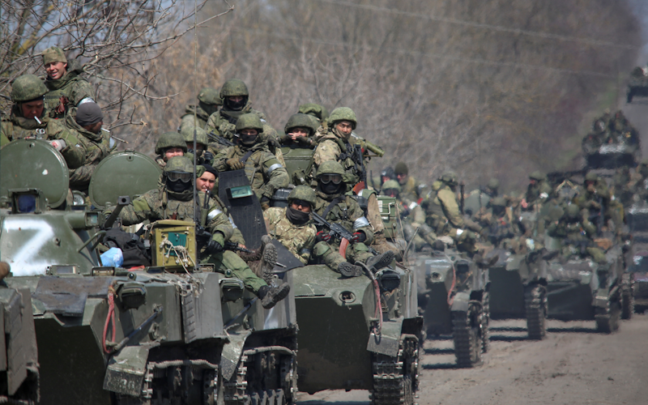
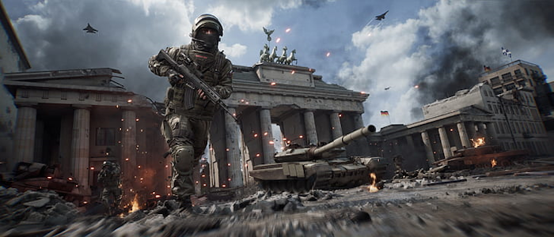
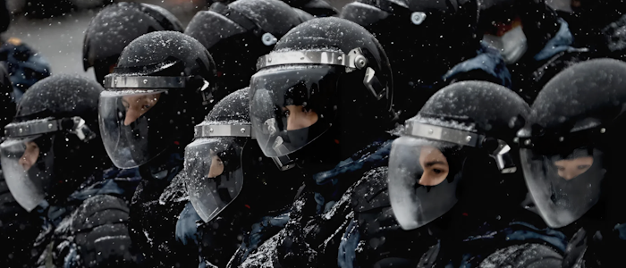

# Российская Федеративная Империя

## Специальная Военная Операция на Украине

В 2022 году Россия объявляет о начале специальной военной операции на территории Украины. Она не идёт на переговоры и вместе с армией Беларуси прорывается прямо к Киеву. Бои за столицу и крупные горда Украины продолжались некоторое время. В отличие от реальной истории, российско-украинская война заканчивается через 2 года сокрушительной победой России. После подписания капитуляции территории Украины от Донецка до Одессы находилась под прямым контролем России. На них был установлен новый субъект - республика Новороссия.

Западные страны резко негативно отреагировали на эти события, поскольку поставки оружия и денег Украине оказались бесполезны, а к введению своего контингента войск Европа была не готова. Сразу после войны НАТО начала тайно спонсировать радикалов на территориях, присоединённых к России. Это вылилось в череду терактов и покушений по всей Новороссии.

## Прелюдия к Третьей мировой войне

Очередной виток эскалации происходит уже через месяц после окончания СВО - происходят [диверсии](https://docs.arussianday.ru/story/conflicts/diversion_potoks/diversion_potoks.html) по всей экспортной газотранспортной системе России. В произошедшем сразу обвиняется Россия, якобы желающая ограничить поставки газа в страны НАТО и найти повод для новой войны.

В ООН назначается собрание: Россия обвиняет НАТО в причастности к серии терактов, подрыву газопроводов и многочисленны покушениям на высокопоставленных чиновников. Она представляет список из 50 лиц, причастных к незаконным действиям, и требует наказания от Международного суда. ООН игнорирует запрос.

Россия, Китай и Иран формируют альянс под названием «Москва — Пекин — Тегеран» (МПТ). 

## Третья мировая война

Весной 2024 года Российская Федерация начинает [наступательную операцию в странах Балтии](https://docs.arussianday.ru/story/ww3/european-front.html#прибалтииское-наступление), нанося ракетные удары по военной инфраструктуре европейских стран. Европу застали врасплох - Россия перевела экономику на военные рельсы еще во время СВО, в то время как европейские левые партии всячески мешали введению обязательной военной службы и расширению оборонного бюджета стран.
НАТО вступается за союзников. Этот акт считается началом Третьей мировой войны. Венгрия резко отказалась от вступления в войну и запретила проход войск через свои территории, что значительно облегчило России [наступление в балканском регионе](https://docs.arussianday.ru/story/ww3/european-front.html#балканское-наступление).

Страны Балтии не смогли дать отпор ВСРФ, Балканский полуостров быстро пал под совместным натиском совместных действий России и Сербии, Финляндия подписала сепаратный мир. Однако в Польше и Чехии российским войскам пришлось противостоять хорошо обученным и подготовленным подразделениям НАТО. За многие города шли тяжёлые бои. Одним из самых кровопролитных сражений стала «Краковская мясорубка». Ожесточённые бои шли и за Варшаву, но польские власти удерживали город до конца. В результате город был практически стёрт с лица земли, а польские войска отступили.
После ряда военных поражений и выхода некоторых стран из войны армия НАТО была полностью деморализована, а среди гражданского населения начали расти антивоенные настроения. Российские войска приближались к Берлину.

Битва за Берлин входит в список самых кровопролитных сражений Третьей мировой войны. Падение города означало поражение всего блока НАТО, поскольку антивоенные группировки ждали подходящего момента, чтобы восстать против своего правительства. Когда город был взят, в Германии произошёл государственный переворот, и новое правительство немедленно подписало капитуляцию и склонило НАТО к тому же.

В 2028 году во Владивостоке был подписан [мирный договор](https://docs.arussianday.ru/story/conflicts/vladivostok_peace_treaty/vladivostok_peace_treaty.html), в котором приняли участие все страны, участвовавшие в Третьей мировой войне, Россия аннексировала территории Польши и Финляндии, установила протекторат над Румынией, Венгрией и Словакией. Чтобы обезопасить восточные территории, в Америке был захвачен Лос-Анджелес.

## Реновация Империи и "Русская Зима"

После подписания Владивостокского мирного договора 25 декабря 2028 года на территории России была провозглашена Российская Федеративная Империя. Президент России Владимир Путин был назначен первым Императором РФИ. Данное событие окончательно закрепило триумф России над западным миром, хотя и являлось исключительно символической реставрацией старых принципов: фактически Россия осталась демократическим государством с новым титулом для президента.

Однако для императорской короны не хватало несколько драгоценных камней. Взор РФИ упал на южные земли в Центральной Азии: с проигрышем НАТО в Третьей мировой войне поддерживаемые странами блока диктатуры столкнулись с отсутствием защиты от амбиций возрождённой Империи.

2 января 2029 года после коротких переговоров на территории Казахстана, Узбекистана, Таджикистана и Киргизии был введён миротворческий контингент ОДКБ, официально преследующий цель "укрепления безопасности региона". Фактически российские войска начали подготовку ко включению республик в состав РФИ: вместе с приходом миротворческих войск в регионах стали запрещать местную культуру, язык и валюту, предлагая вместо неё расплачиваться рублями РФ.

За кулисами представителям четырёх республик, а также Туркменистана, был направлен ультиматум: страны входят в состав РФИ при сохранении власти текущих президентов на правах автономных республик. Туркменистан стал единственной отказавшейся республикой, после чего последовала "Шестидневная война", официально называемая в средствах массовой информации РФИ как "Контртеррористическая операция в Туркменистане". Благодаря активному применению современных технологий и БПЛА Россия смогла принудить Туркменистан к вхождению в состав страны на худших условиях, нежели чем согласившиеся государства. КТО вызвала одиночные протесты остатков либеральных сил в крупных городах РФИ.

10 и 11 февраля 2029 года был проведён референдум о вхождении государств Центральной Азии в состав России, называемый в мировых СМИ как "Русская Зима". Позднее данное название, по аналогии с "Русской Весной", закрепилось и в официальной государственной повестке РФИ. По данным ЦИК РФИ, за воссоединение с Россией проголосовало свыше 87% граждан Казахстана, 92% граждан Таджикистана, 90% граждан Киргизии и Узбекистана, 85% граждан Туркменистана. В отличие от Русской Весны, в этот раз не было возгласов о "недемократичности" референдумов - мероприятия прошли мирно и при минимальных возмущениях со стороны антивоенно настроенных граждан РФИ.

Русская Зима стала одним из финальных аккордов в русской ирреденте и крупным дипломатическим успехом правления Путина, окончательно закрепляя роль русского государства как "Хранителя Евразии".

## Оттепель и "Движение Подснежника"

Восстановление законных границ РФИ, хотя и прошло относительно мирным путём, не решило важных государственных проблем: система за шесть лет боевых действий сильно перестроилась на военную экономику и до сих пор не могла окончательно демобилизоваться. По европейским границам Империи начало набирать популярность "Движение Подснежника", объединяющее разнообразные этнические национальные группы, не желающие находиться в составе державы и требующие независимости. В Центральной Азии ФСБ периодически приходится отлавливать сепаратистов, стремящихся к уничтожению русской культуры и сохранению "национального суверенитета" бывших государств.

Изменения пошли и в "старой России": выросло число либерально настроенных политиков в регионах, политическая культура была расширена - регистрацию в Министерстве юстиции получили ранее неодобряемые крылья Либертарианской партии России и "Другой России". Кроме того, был принят новый закон об иностранных агентах, согласно которому для включения в реестр обязательной стала публикация материалов, по которым то или иное лицо было включено в список.

Кроме того, гражданское общество стало оказывать больше влияния на политическую обстановку: сюда входили как бывшие военные, так и граждане различных взглядов - левые, правые, либералы, консерваторы: политика стала интересом масс, а не увлечением элит, как это было в начале 20-х годов XXI века.

