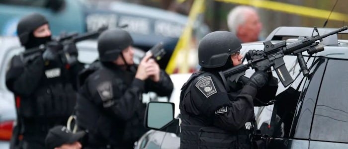

# Русский Западный Военный Лагерь

## Детище Владивостокского договора

Во время составления [Владивостокского мирного договора](https://docs.arussianday.ru/story/conflicts/vladivostok_peace_treaty/vladivostok_peace_treaty.html) Россия заботилась о безопасности не только на западной границе, но и на восточном рубеже. Были рассмотрены варианты взять "в аренду на неопределенный срок" Аляску со всеми прилегающими военными базами, но такой вариант был слишком дорогостоящим и рисковал быть отвергнутым самими США - объем потерянных территорий переходил все допустимые рамки, учитывая что США не потеряли во время войны ни пуда земли. 

В качестве альтернативы была рассмотрена аренда Лос-Анджелеса - крупнейшего города на западном побережье США с легкодоступной логистикой и небольшим объемом прилегающих территорий. Данный вариант и лёг в окончательные тарктовки договора. Передача города такой важности значительно пошатнула авторитет кабинета Трампа и в какой-то степени определила итог последующих выборов.

## «Бастион Тихого океана»

На пост главнокомандующего тихоокеанской группой войск и коменданта Лос-Анджелеса был выбран снятый с должности (официально просто "переведенный") министр обороны Сергей Шойгу. С первых дней в город стали переводить опытные боевые подразделения, огромные средства и все виды вооружений. РЗВЛ стал ключевой военной базой Тихого океана.

Российский триумф на американском континенте омрачался вспыхнувшими протестами на всей территории Лос-Анджелеса. По распоряжению Шойгу беспорядки, грозящие перейти в боестолкновения с армией и полицией, должны жёстко подавляться. В результате ситуация временно стихла и обошлась десятком раненных.

## Напряжение отношений с Калифорнией

Когда в Калифорнии начали нарастать сепаратистские движения, Лос-Анджелес оказался самым спокойным местом на западном побережье. Социалисты, укрепив своё положение, пытались подавить режим Шойгу в Лос-Анджелесе пропагандой и внешней разведкой, сумев немного поколебать его влияние. Это сильно напрягло отношения между Россией и Калифорнией, но Шойгу пытался проводить политику примирения со своим новым соседом.

В 2029 году правительство Калифорнии провело дерзкую операцию и попыталось захватить некоторые районы пригородов Лос-Анджелеса. Атака была отражена, но отношения между РЗВЛ и Калифорнией были окончательно повреждены. Шойгу начал осознавать необходимость создания «буферной зоны» и увеличения военного присутствия в городе. Калифорния же не собиралась мириться с поражением и готовилась с крайним мерам...

