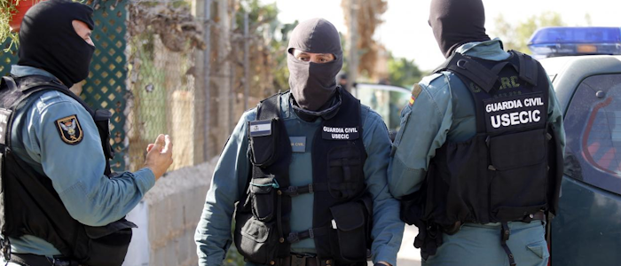
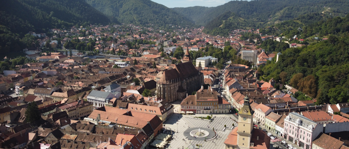

# Трансильвания

**Сопротивление Румынии**

С началом Третьей Мировой войны Румыния начала полномасштабную мобилизацию, чему сопротивлялось население многих румынских регионов, в том числе и Трансильвании. В стране сложилась критичная ситуация - Венгрия отказалась вступать в войну и перевозить армейскую логистику по её территории, что отрезало по земле Румынию и другие балканские страны от европейских союзников.
Российская армия достаточно быстро захватила территории Молдовы и уже перешла в наступление на приграничные регионы Румынии. В затылок дышала Сербия, которая вступила в войну на стороне России и имела свои успехи в боях.

Военные поражения ввели в отчаяние даже самых патриотичных граждан. Администрация Трансильвании не собиралось становиться жертвой халатности правительства Клауса Йоханниса и объявила о немедленном отделении от Румынии до стабилизации ситуации в стране. Сепаратистов возглавил политик Иоан Рус. Румынские резервы были сразу же брошены на подавление, казалось бы, заведомо провального восстания, но критическая нехватка солдат не дала армии пробить оборону ополченцев. Вскоре Румыния оказалась под полным контролем армии России, а Трансильвания подписала сепаратный мир.

**"Искусственное государство"**

После окончания войны Трансильвания оказалась в экономической зависимости от России. На страну также давила Румыния, которая не собиралась мириться с потерянными территориями. Венгрия признала независимость Трансильвании, но ясно давала понять, что также претендует на свой кусок пирога в случае обострения ситуации в регионе.
Трансильвания - не национальное государство, которое могло бы легко сплотить народ вокруг долгожданного обретения независимости. Но и возвращаться в состав (пусть уже "новой") Румынии правительство не собиралось. Разбираться со своими внутренними проблемами решили своими силами.

