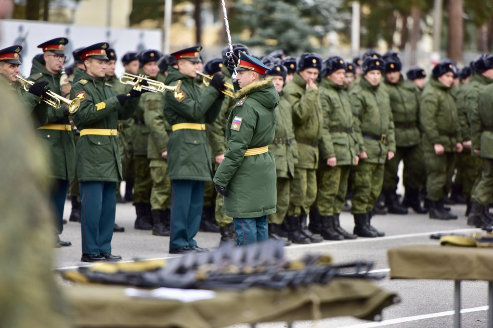

# Глава I: Последнее предупреждение

Первые трещины в мировом порядке уже дали о себе знать - они проявляются во всех сферах жизни общества, от экономики до геополитики. Мир активно меняется с невиданной ранее скоростью, и те, кто не готов адаптироваться к новым реалиям, неизбежно окажутся на обочине истории или вовсе исчезнут. Мир меняется, а вместе с ним трансформируются и его правители: это естественный и циклический процесс, повторяющийся на протяжении всей человеческой истории. 

Владимир Путин прекрасно осознавал эту неумолимую истину. На протяжении двух десятилетий президент неустанно пытается догнать запад, стремясь перехватить их стратегическую инициативу: двадцать долгих лет попыток, не принесших желаемого результата. Но сейчас однополярный мир, выстроенный после холодной войны, как никогда находится в шатком положении, балансируя на грани глобальных перемен. Времени на размышления и выжидание больше не осталось - Россия должна действовать решительно и незамедлительно.

Россия стала готовиться к большому конфликту. Тайно уже с 2020 года страна начала мобилизовать экономику, расширять состав армии, спешно вводить в массовое производство ранее лишь «показные» разработки. Ещё не было точной цели удара, но страна была готова к эскалации в любой момент.

В ответ на мобилизацию, Запад начал вводить санкции против России, подрывать российские цепочки поставок, различными способами ограничивать экспорт из страны. ЕС и США объявили энергетическую блокаду, устроив блокаду российских экспортных энергетических ресурсов. Конечно, это всё не прошло бесследно, но Россия успешно настраивала торговые и политические связи с Востоком, частично компенсируя их потери.

Совместно с экономическим фронтом, бои велись на политическом: оппозиция была задавлена и растаскана, после переписи конституции выборы президента превратились в условность, а Путинский режим лишь крепчал. Жёсткая информационная война между Россией и Западом набирала обороты. Обе стороны стремились контролировать общественное мнение и управлять нарративами общества. Это была точка невозврата - момент, когда демократические институты окончательно утратили свою силу, уступив место жесткой вертикали власти.

Окончательный вывод американских войск из Афганистана дал России зелёный свет. В сентябре 2021 года началась подготовка к специальной военной операции. По обе стороны конфликта все понимали — война неизбежна. 

Тот день настал: 24 февраля 2022 года ВС РФ и Беларуси ввели войска в Украину. По масштабу новая война в Европе была крупнейшей за последние годы. Объединённое командование ЕС и НАТО начало всестороннюю поддержку Украины: в страну поехали ленд-лизы, дешёвые кредиты, военные специалисты, солдаты. В течении полугода НАТО превратила ВСУ из небоеспособной кучки ополченцев в одну из крупнейших армий Европы. 

Но это не помогало. К марту были захвачены Херсонская и Запорожская области, в апрельском наступлении был сдан Харьков, к концу лета ВСУ теряют инициативу в Битве за Донбасс. Уже зимой 2023 года совместная русско-беларуская группировка захватила Киев, ознаменовав конец войны. Правительство Украины подписало безоговорочную капитуляцию. Отдельные боевые группировки были подавлены в течении нескольких недель, остатки бежали через границу и примкнули к НАТО. 

Поражение Украины привело к серьёзным изменениям в политическом балансе на мировой арене: все понимали, что это лишь начало. 