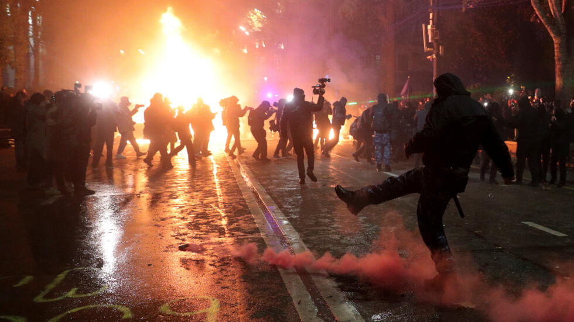
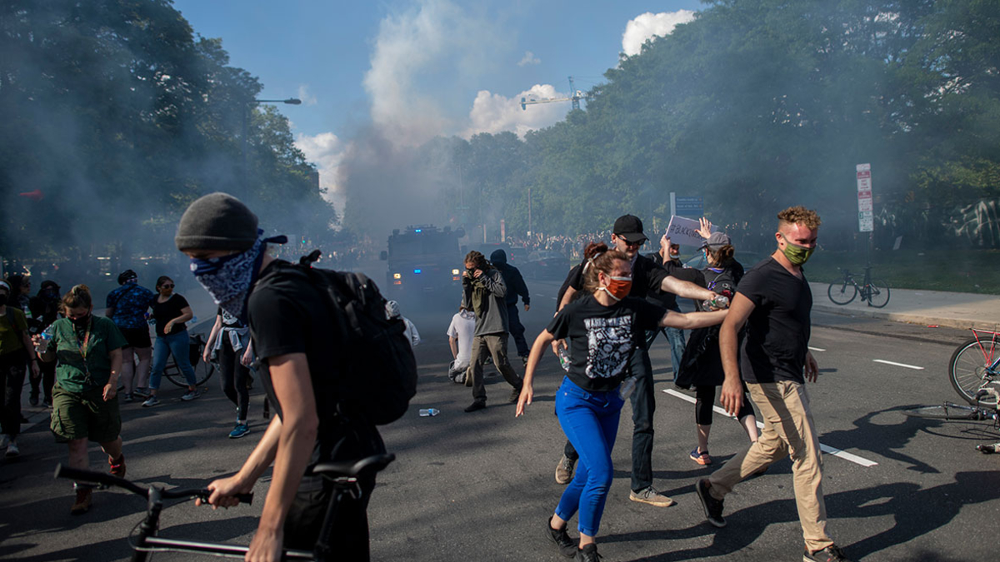

# Глава II: Расколотый мир

Поражение Украины стало тяжёлым ударом для западного общества. Война обошлась слишком дорого как экономически, так и морально: Европа получила лишь многомиллиардные убытки, разрушенные иллюзии о НАТО и углубляющийся кризис доверия к правительствам. Общество требовало перемен, а политическая повестка начала резко смещаться: правящие партии теряли поддержку, уступая популистам левого и правого толка. 

В Европе политическая и экономическая нестабильность переросла в системный кризис. Энергетический шок, вызванный отказом от российских энергоресурсов, дестабилизировал промышленность, вызвал скачки цен и усилил недовольство среди граждан. В Германии «Светофорная коалиция» подорвана ударом от Die Linke и АдГ, усугублённый потоком украинских беженцев. В других странах ЕС наблюдался рост влияния популистских движений, выступающих за пересмотр западной стратегии.

На этом фоне Китай продолжал наращивать своё влияние в Евразии. Инициатива «Один пояс, один путь» укрепляла его позиции в Африке, Центральной Азии и России. Экономическая интеграция шла параллельно с военным сотрудничеством: совместные учения, торговые соглашения и дипломатическая работа подмачивали силы Запада.

Тем временем в США назревала одна из самых ожесточённых предвыборных кампаний в истории. Поляризация общества достигла предела, компромиссы стали невозможными. Усиливающийся экономический кризис, колоссальная бюджетная дыра после поддержки Украины и отказ Джо Байдена баллотироваться на второй срок лишь подливали масла в огонь. Обе стороны прибегали к сомнительным методам, стремясь обеспечить себе победу любой ценой.

После того как Джо Байден объявил, что не пойдёт на выборы, внутри Демократической партии началась борьба за лидерство. Центристы, желающие сохранить статус-кво, столкнулись с левыми радикалами, требующими кардинальных перемен. В итоге компромиссной фигурой стала Камала Харрис, сумевшая заручиться поддержкой партийных элит. Однако её кандидатура разочаровала левое крыло, ожидающего более решительных действий.

Республиканцы же, напротив, выступили более организованно. Дональд Трамп, несмотря на несколько судебных разбирательств, сохранил контроль над партией и остался одним из самых популярных кандидатов. Однако на первый план также вышли новые фигуры — Никки Хейли, известная своим жёстким консервативным курсом и агрессивной внешней политикой, а также Джей Ди Вэнс, представляющий новую волну изоляционистов.

Соперничество между партиями было ожесточённым: республиканцы сумели привлечь консерваторов благодаря сочетанию харизмы Трампа и новой стратегии, ориентированной на защиту традиционных американских ценностей. Демократы же делали ставку на сохранение внутренней стабильности и преодоление кризиса.

В последний день перед выборами обе партии провели завершающие митинги, сопровождающиеся напряжённой атмосферой. СМИ активно предупреждали о возможности беспорядков, а власти усилили меры безопасности.

День выборов ознаменовался рекордной явкой — 142,1 млн человек. Счёт был максимально близким, на почве чего обвинения во вмешательстве и фальсификациях раздавались с обеих сторон. Однако после победы республиканцев в Пенсильвании, победа Дональда Трампа была предрешена. 

Реакция общества была бурной: часть крайне левых социалистов, объявили о разрыве с Демократической партией и начали формирование собственного движения. В то же время среди умеренных республиканцев и традиционных консерваторов росло недовольство тем, что республиканскую партию вновь возглавил «шоумен».

Открытых столкновений удалось избежать, но политическая система США дала первую серьёзную трещину. Начиналась новая эра нестабильности.

Уже в январе 2025 Дональд Трамп принял присягу, став 47-м президентом США. Получив подавляющий контроль как над Белым Домом, так и над Конгрессом, Дональд Трамп начал глобальную перестройку страны. В дни и недели начались подписываться сотни документов и законов самого разного толка и значимости. Под нож попадало всё: решения прошлого правительства, гранты, пособия, всевозможные «прогрессивные акции». Страна приняла крайне правый курс, и никто не знал, к чему это приведёт. 

Внешняя политика Соединённых Штатов вступила в эпоху радикальных перемен. Вашингтон разрывал связи с Европейским Союзом, Канадой и Мексикой, демонстрируя резкий отход от прежнего курса. Европа, ещё недавно воспринимавшая США как бесспорного лидера, теперь сталкивалась с нарастающим давлением и требованиями безоговорочного подчинения.

Новая администрация, действуя поспешно и радикально, подрывала единство НАТО тогда, когда альянс нуждался в сплочённости больше всего. Агрессивный внешнеполитический курс не только посеял раздор среди западных государств, но и поставил под угрозу сплочённость и боеспособность НАТО. Однако осознание последствий прийдёт слишком поздно — тогда, когда исправить ситуацию уже не выйдет.