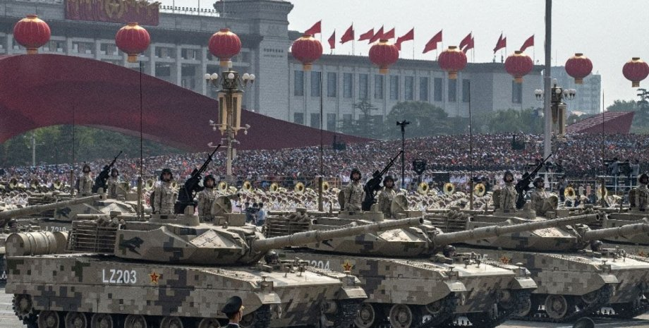

# Глава III: Начало конца

Западный мир горит в огне, занимаясь массовым саморазрушением. Восток, понимающий шаткость текущего миропорядка, начал действовать. Вскоре верхушкам правительственных элит стало понятно, что избежать новой войны не получится: значит надо к ней готовиться. 

В марте Китай объявляет о формировании Азиатско-Тихоокеанского Пакта (АТП), военного альянса направленного на глобальную защиту Азии от западных сил. Фактически, АТП являлся мерой сдерживания для НАТО. 

Первыми участниками пакта стали Китай, КНДР, правительственные силы в Мьянме, Лаос и Камбоджа. Уже в течении первых недель были подписаны договоры о стратегическом сотрудничестве между ОДКБ и АТП, создающие глобальную ось сопротивления западу, и гарантирующие двухсторонние гарантии безопасности. Уже вскоре после подписания договора Иран, Пакистан и Индонезия выразили желание развить отношения с АТП.

Реакция НАТО была незамедлительной: альянс объявил о необходимости глобального сотрудничества между странами для защиты от агрессивной политики Китая и России. В ответ на действия АТП, Южная Корея, Япония, Тайвань и США объявили о формировании военного альянса: Pacific Treaty Organisation (PTO). Альянс стал важным стратегическим партнёром NATO в Тихом океане, были подписаны договоры о взаимных гарантиях безопасности. 

Соединённые Штаты объявили программу по экономической и торговой блокаде АТП, фактически объявив эмбарго и выведя торговую войну с Китаем на совершенно новый уровень. Уже спустя несколько часов после выступления Дональда Трампа, любые экономические сообщения с Китаем были заблокированы и государственная граница была закрыта. 

Уже в течении первых дней после ввода эмбарго, экономики обоих держав рухнули: миллионы китайских рабочих потеряли работу в экспортных отраслях, большая часть производства Соединённых Штатов закрылась или перешла на дорогие альтернативные цепочки. Это событие вызвало резкий финансовый шок: Китай, являющийся одним из крупнейших кредиторов Американского госдолга, продал своих облигаций на 800 миллиардов долларов, обвалив курс доллара. 

Уже вскоре весь мир принял ударную волну, погрузив глобальную экономику в кризис. Вскоре масштаб трагедии превзошёл Великую Рецессию 2008 года. Мировая напряжённость выросла до предела, последние сдерживающие барьеры пали: вскоре разразится новая мировая война. 