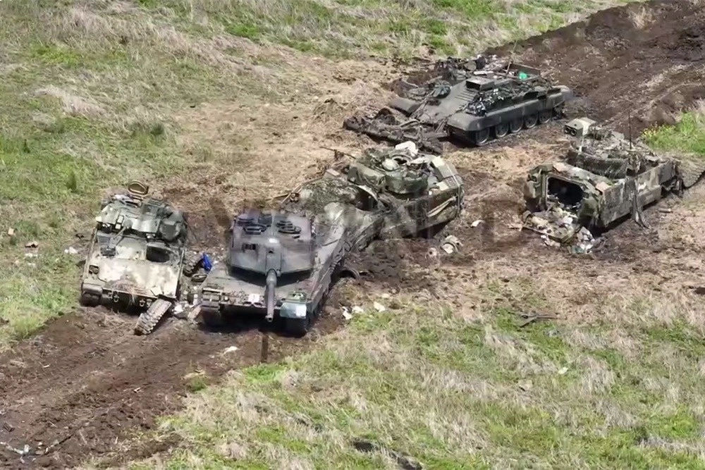

# Европейский фронт

## Прибалтийское наступление

16 апреля 2025 года, примерно в 4 часа утра, Вооружённые Силы России пересекли границы прибалтийских стран. В течение следующего часа по крупнейшим восточноевропейским городам были нанесены ракетные удары: Таллин, Рига, Варшава, Прага и многие другие оказались под атакой. Россия задействовала системы РЭБ, временно парализовав большую часть внутренней связи НАТО.

Первыми бой приняли национальные армии Прибалтики и Польши, а также немногочисленные механизированные отряды реагирования НАТО (~3 тысячи человек), разместившиеся вдоль рек и в глубине стратегических объектов. В это же время НАТО активировало силы ВВС, навязав бой российской авиации.

Россия же начала массированное механизированное наступление при поддержке артиллерии. Огонь на подавление максимально эффективно уничтожал вражеские укрепления, но ценой больших потерь среди мирного населения. 

Российские БПЛА смогли уничтожить инфраструктуру и снабжение, оттянув прибытие подкрепления. Уже на третий день был полностью пробит Сувалкский коридор, линии обороны НАТО были захвачены российскими танковыми кулаками. ВС РФ подошла к столицам прибалтийских городов.

Прибывшие польские и немецкие танковые подкрепления начали контрнаступление с юга на 6 день войны, но Россия уже капитулировала Вильнюс и Таллин, Рига находилась фактически в окружении. На 8 день все остатки прибалтийских войск бежали или сдались в плен. Российский блицкриг удался, дорога на Польшу была открыта!  

К середине мая фронт уже стоял у польских городов Белосток и Ольштын. Основные силы НАТО были сконцентрированы именно на этой линии обороны — альянс был намерен остановить российское наступление.

28 мая Россия начала массовые артиллерийские и ракетные обстрелы по европейским укреплениям и городам. Удары нанесли огромный ущерб как военным, так и мирным, но для ВС РФ они обошлись высокой ценой — британская и французская воздушная разведка успешно находили и уничтожали незащищённые артиллерийские позиции русских.

На следующий день началось наступление. Штурмовые отряды при поддержке тяжелых танков начали ожесточённую зачистку узких городских улиц, выгоняя поляков из укреплённых позиций. Благодаря поддержке НАТО наступление удалось остановить, но оба города превратились в мясорубку для стали и пехоты, вынуждая стороны нести высокие потери для сохранения своих позиций. Россия потеряла инициативу в городе, но опыт штурмовых подразделений со времён войны в Украине (таких, как например ЧВК Вагнер) позволил удержать стратегически важные объекты.

Ольштын был сдан 13 июня. Польские силы отступили на более выгодные рубежи и закрепились в болотах на востоке. Белосток ждала не лучшая судьба: два жизненно важных шоссе, шоссе 19 и шоссе S8 были отрезаны русскими. НАТО не успело сориентироваться, и вскоре город оказался в окружении. Солдаты предпочли не умирать и сдались врагу.

Европа потеряла не только линию обороны. Европа потеряла лучших бойцов, технику, и самое главное: веру в победу. Русские праздновали победу, но для них это наступление не прошло бесследно: жестокое и во многом кровавое наступление унесло за собой множество жизней. На телевизоре об этом молчали, но на фронте никому не было от этого легче.

## Балканское наступление

Затяжные бои под Польшей затянулись до августа, когда стало понятно, что НАТО отступили на выгодные оборонительные рубежи и без инициативы их было не выбить. Россия предприняла неочевидный и рискованный шаг — бросить все наступательные силы на Балканский полуостров. Главным мотиватором стал выход Венгрии из войны — после серии мирных протестов Виктор Орбан, президент Венгрии, решил подписать сепаратный мир с Россией и полностью выйти из НАТО.

В ответ на выход из альянса, Североатлантический альянс объявил о проведении операции по "восстановлению контроля над ситуацией". Со стороны Словакии и Чехии выехало несколько бронетанковых бригад, а крупные города Венгрии оказались под жесточайшим ударом авиации. Альянс считал, что венгерская армия не решится их атаковать и они смогут без крови вернуть контроль над Венгрией. Однако, ВС Венгрии не отреклись от своего президента и атаковали войска НАТО, ознаменовав начало новой войны.

3 сентября ВС РФ начали операцию "Железный коридор" — серия мощных прорывов вглубь Румынии и Молдовы с целью полной дезориентации противника и отделении этих двух стран от НАТО. Со стороны Приднестровья были выдвинуты танковые подразделения для взятия Кишинёва, со стороны Украины — пехотные и штурмовые отряды для взятия городов Сату-Маре и Бая-Маре.

Шоссе R2 и R5, ведущие до Кишинёва были подорваны и приведены в негодность, заставив Россию свернуть на юг и север. 4 сентября произошёл бой в городе Бируинца под Бельцами, в ходе которого дезорганизованные молдовские войска отступили. На следующий день после такого же неудачного боя был взят город Бельцы. В этот же день был спущен десант на Кишинёв, оперативно оккупировавший главные правительственные здания города. Большинство политических деятелей успело сбежать за границу, но был арестован премьер-министр Дорин Речан. В следующие два дня Россия заняла ещё больше поселений, в том числе со стороны Одессы, после чего Молдова капитулировала.

Следующий вектор наступления — Румыния. Даже без сухопутной поддержки со стороны НАТО, румынская армия составляла более 140 000 военных. 2 сентября штурмовые подразделения начали атаку Сату-Маре и Бая-Маре, столкнувшись с региональным ополчением. Оба города были сданы за два дня, а 6 сентября российские войска соединились с венгерскими в городе Карей. Две армии встретили друг друга радушно, вскоре Венгрия вступит в ОДКБ на стороне России. Но главный бой пришёлся на города Яссы и Галац — русских встретили механизированные и танковые войска, расположенные в регионе.

В городе Яссы танковое наступление было встречено 151-й механизированным пехотным батальоном "Războieni" и 198-м логистическим батальоном "Prut". В ходе серии столкновений было взято железнодорожный терминал и сёла вокруг международного аэропорта. Вскоре открытый огонь артиллерии заставил румын отходить вглубь города, где они потеряли инициативу и были вовлечены в ближние бои против обученных штурмовых отрядов ВС РФ. Яссы был сдан 11 сентября, но механизированные войска смогли отступить без серьёзных потерь и сохранить силы.

Наступление на Галац прошло для России менее удачно — танковые войска оказались втянуты в бои против 284-го танкового батальона "Cuza Vodă" и не смогли эффективно поддержать штурмовиков в городе. 300-й механизированный пехотный батальон «Sfântul Andrei» отбил наступление. ВС РФ применили тактику "выжигания" — вместо попыток штурма города были задействованы ракетная артиллерия, авиация и дроны. Небольшие воздушные бои близи города Россия победила, и небо оказалось чистым. Под давлением город сильно пострадал, и румынские войска были вынуждены отступить 24 сентября.

В это же время Сербия, заметившая нестабильность в регионе, решает захватить Косово. 30 сентября Сербские ВС начинают операцию, и в ходе кровопролитных боёв оккупируют большую часть страны к 14 октября. Действия Сербии встречают крайне негативно в мировом обществе, но НАТО не решается нападать на Сербию. Окрылённые успехом, сербы полагают, что НАТО испугается и не будет защищать другие балканские страны — Черногорию и Македонию. 16 ноября Сербия бомбит Черногорию и начинает наступление, призывая страны-участницы НАТО не вмешиваться. НАТО, боясь окончательно потерять репутацию, активирует Статью 5 и объявляет войну Сербии. Операция "Союзная сила" возобновляется впервые с 1999 года. В этот раз Сербия, при поддержке ВВС РФ оказывает сопротивление американской и немецкой авиации, частично защищая крупные города страны. Сербия быстро оккупирует Черногорию и Македонию и вступает в серьёзные бои с Румынией, Хорватией и Боснией, которая вступила в НАТО незадолго после начала войны.

К середине января Венгрия окончательно вступает в ОДКБ. Россия вводит ограниченный контингент для поддержки Венгрии, а также начинает наступление на Словакию со стороны Украины и Венгрии.

Румынское положение удручает — одновременная война на три фронта и ряд политических и военных поражений вызывает массовые гражданские беспорядки. На фоне протестов и политической нестабильности, Иоан Рус формирует Трансильванское восстание с целью заменить правительство Румынии и подписать сепаратный мир с Россией, как это сделала Венгрия. В марте начинаются первые погромы, скоро переросшие в боевые действия — протестующие захватили Клуж и объявили о создании Трансильванской Республики. Румыния не смогла солдат восстания ввиду нехватки личного состава и партизанской тактики первых.

14 июня Россия начинает полномасштабный десант в городе Констанца, а 17 июня сербские войска оккупируют город София в Болгарии. Румынские ВС дали серьёзный бой в Констанце, выдвинув свои механизированные и танковые бригады из Бухареста. Россия, использующая свой флот для огневого преимущества успешно занимает "Старый город", продвигаясь на юг к порту и железндорожному депо. В попытках остановить наступление, румыны занимают оборонительные рубежи южнее российского десанта, но при поддержке БПЛА и авиации, ВС РФ удаётся занять важные промышленные постройки и, вскоре, занять ключевой порт Румынии.

К сентябру российские войска подходят на расстояние артиллерийского огня по Бухаресту. ВС РФ начинают бомбить город, вынуждая Румынию сдаться, и под давлением населения, Бухарест подписывает безоговорочную капитуляцию перед ОДКБ и Трансильванией.

К октябрю сдаётся и Болгария, подписывая отдельный договор с Сербией о вступлении в новый "Югославский Союз". НАТО потерпело поражение на Балканах во многом из-за слабой поддержки своих союзников ввиду вступления в войну Венгрии и Сербии. Североатлантическому альянсу необходимо предпринять меры, чтобы не допустить повторения подобной трагедии в будущем.

## Первые перемирия и волна переговоров

На фоне неудач НАТО на Балканах, Россия решила предложить НАТО начать переговоры о временном перемерии или окончании войны. Брюссель принял предложение, но в ходе недолгих переговоров в феврале 2026-го обе стороны не смогли прийти к консенсусу: Россия требовала внеблокового статуса для Польши, Чехии и Словакии, а также вступлении Прибалтики в ОДКБ, по факту "откатывая" границы НАТО вплоть до 1990-го года. Переговоры завершились лишь временным перемирием 23—25 февраля и частичным обменом военнопленными.

Попытки продолжить диалог предпринималиь и позднее, но Россия всегда ставил невозможные условия для Североатлантического альянса, как будто бы специально оттягивая процесс переговоров и выставляя себя в лучшем свете перед мировым сообществом. В итоге, максимальный успех, полученный во время переговоров: нерегулярные обмени военнопленными и гуманитарные конвои из небольших и строго определённых зон территорий, оккупированных Россией. 

Всем было очевидно, что ни одна сторона не была готова сдаваться.

## Гданьский манёвр

К этому времени граница фронта дошла до городов Сельдце и Эльблонг в Польше. Россия готовилась к новой волне наступления и штурму реки Висла, но Россия теряла много людей и снаряжения после каждой атаки ввиду серьёзного польского сопротивления. 

Понимания опасность этой идеи, Генштаб ВС РФ решил действовать более стратегически — было принято решение десантироваться в Гданьске и вместе с основной армией начать наступление на юг. Захват морских портов Гдыни и Гданьска приведёт к значительному усложнению военных поставок из западных стран и вынудит их перейти на более долгие и менее эффективные сухопутные пути снабжения. Это позволит ослабить мультинационый состав, стоящий по польской границе и провести успешное форсирование реки.

Первые боевые действия начались 7 марта с крупного морского сражения в Балтийском море: флот ВМФ РФ засек множественный конвой противника, охраняемый эсминцами и итальянским авианосцем «Кавур». Обычно, НАТО отправляет конвои по одиночке или в составе малых групп, стараясь не привлекать внимания, но этот раз был особенным — 30 конвоев с огромным щитом ввиде самых современных флотов, что Европа только могла подготовить за такой короткий срок.

Это был шанс: успешная победа в сражении не только откроет небольшое окно для вторжения в город, но и поставит под сомнение весь авторитет НАТО в Балтике. 

Космическая разведка и БПЛА дали возможность сформировать общий состав флота: 30 транспортных конвоев, охраняемые множественными эсминцами с ПВО и ПРО, а также флагманский авианосец "Кавур", способный нести авиакрыло из F35-B. Россия решает сделать ставку не на открытое морское сражение, а на засадную тактику и технологическую войну.

ВМФ РФ начинает свой первый ход. Подлодки занимают позиции на вероятных маршрутах, начинается деозриентация врага: применение РЭБ для подавления GPS и искажения РЛС, запуск ложных целей и имитации выстрелов противокорабельных ракет держат вражеский флот в постоянном страхе и вынуждает неэффективно группироваться.

НАТО отвечает постоянными дежурствами F-35B, замедлением хода транспортных кораблей и сближением всего ордера кораблей. 

Российские подводные лодки начинают охоту — расставляют мины и торпедируют фрегаты ПЛО на максимально возможном для атаки расстоянии. НАТО теряет 2 корабля охранения, останавливает конвои и начинает тратить ресурсы на охоту за подлодками.

В этот момент Россия ударяет всем, что было: массовый залп ПКР с берега, надводных кораблей и авиации по эсминцам. Из-за массовости атак эсминцы перестают успевать за темпом боя и теряют некоторые транспортные корабли, "Кавур" уходит в режим обороны и отступает, а конвой с многочисленными потерями вынужден отступать под огнём врага.

Кульминация не заставляет себя долго ждать. НАТО хоть и не понесло трагических потерь, но потеряло любую инициативу в регионе и было вынуждено самостоятельно закрыть для себя Балтику во избежание новых потерь. Это была разгромная победа России. Благодаря свободному море вскоре России удаётся совершить удачный десант в городе, и к 20 марта оба города оказываются под контролем России.

## Форсирование Вислы и битва за Варшаву

Теперь дорога на юг была свободна — со сбитыми графиками снабжения и невыгодной позицией с точки зрения инициативы, НАТО очевидно не могло долго удерживать территорию восточного берега Вислы. В июне начинается массовое механизированное наступление России с целью занять как можно большую площадь за наименьший отрезок времени. Всего за полтора месяца оказываются захвачены города Грудзёндз, Плоцк, Торунь, Быдгощ. Варшава оказывается зажата российскими войсками, и уже 28 августа, после волны атак БПЛА и ракет, Россия начинает штурмовать пригороды Варшавы. В отличие от остальных городов, Варшава была защищена как крепость — 