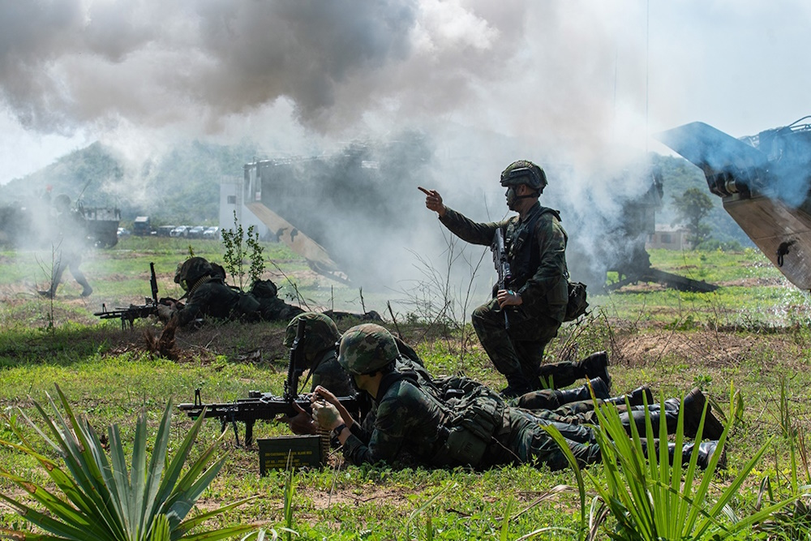

# Азиатский фронт

## Вторжение на Тайвань

Ранним утром 16 апреля 2025 года ракетные войска Народно-освободительной армии Китая нанесли серию массированных ударов по военной и логистической инфраструктуре Тайваня, местам базирования военных и береговым укреплениям. Системы ПВО значительно утратили эффективность, открыв пространство для авиаударов и воздушно-десантных операций. Флот начал блокаду острова и нанес удары по целям на береговой линии. Вслед за градом ракет был отправлен крупный морской десант, включающий элитные подразделения армии Китая.

В тот же час за Тайвань вступились его ближайшие союзники по [PTO](https://docs.arussianday.ru/story/third-chapter.html#глава-iii-начало-конца) - Южная Корея, Япония и США. Активизировались вооруженные силы острова и иностранный контингент. 
Китайский морской десант ударил сразу с нескольких направлений. Главная по масштабам операция развернулась на севере, в районе Тайбэя и порта Цзилун. Второстепенный характер носили высадки с запада и востока, необходимые для отвлечения резервов и захвата аэродромов. 

Параллельно с морскими высадками проводились операции воздушного десантирования на точки вглубине острова: внутренние аэродромы и узлы коммуникации. 
"Молниеносного захвата", который требовал генеральный штаб НОАК, не произошло. Северный десант долгое время не мог пробиться через уцелевшие укрепления и плотную городскую застройку, в то время как западная и восточная операции смогли продвинуться вглубь, но были замедлены резервами. К тому времени уже открылся корейский фронт, что вынудило иностранный контингент постепенно частично эвакуироваться. Это ослабило защиту армии, и уже к концу июня остров был полностью сдан и зачищен. 

## Корейское наступление

Ким Чен Ын уже давно планировал воссоединение Кореи, план оттачивался до малейших деталей. Наконец, представился удобный шанс. 

25 апреля дивизии КНДР вступили в боестолкновения с южнокорейскими пограничниками. В отличие от конфликта 1950 года, на стороне северокорейцев сразу выступали китайские подразделения, но и Южная Корея была значительно лучше подготовлена по сравнению с прошлыми неудачами, а также имела на своей территории внушительный контингент армий Японии и США. 

Стремительное наступление сил [Азиатско-Тихоокеанского пакта](https://docs.arussianday.ru/story/third-chapter.html#глава-iii-начало-конца) замедлилось у крупных городов Сеул и Чхунчхон. Затруднялось форсирование рек Ханган, Имджинган и Пукханган, где атакующие армии были встречены хорошо подготовленными подразделениями США и Кореи. Начался период утомительной борьбы за каждый населенный пункт.

За Сеул завязался ожесточенный бой, продлившийся 4 месяца. Крупнейшая группа армий противника удерживала город. Под натиском сил КНДР и Китая город пал к концу декабря, во многом оставив от него лишь руины. Дорога на юг была открыта. 

## Марш-бросок до Пусана

Фронт обрушился, северокорейцы пробивались всё дальше и дальше, брали город за городом. США на фоне ухудшения обстановки на всех фронтах  Третьей Мировой начала эвакуацию контингента в Японию и Европу, предрешив судьбу Южной Кореи. 

Ключевые города были взяты уже к марту 2026 года, остатки южнокорейских войск оступили со всех направлений и укрепились в Пусане, готовясь к последнему бою. Китай и КНДР не жалели боеприпасов и людских ресурсов, наступали на город со всех сторон. В мае Пусан был сдан. Одна часть южнокорейских подразделений попала в плен, другая - эвакуировалась на остров Чеджудо.

## Сорванный мир

Китай вышел на связь с правительством Японии, предложив заключение мира. Договором предполагалось признание прав Китая и КНДР на территории Тайваня и Южной Кореи, а также определение статуса Японии как нейтрального государства в политическом и военном плане.

Встреча делегаций состоялась на неитральной территории в тайландском Бангкоке. Встреча продлилась всего 2 часа. Японцы преждевременно покинули место переговоров, заявив, что их не устраивает мирный план Пекина и они будут добиваться освобождения захваченных территорий. Позже выяснилось - большое влияние на решения японского правительство оказали США. Кабинет Трампа надавил на делегатов и пообещал обеспечить страну всем неоходимым для ведения войны.

## Морские баталии

В азиатском регионе оставался единственный противник Китая - Япония. Пусть оборонительная армия страны не представляла сильной угрозы, высадка грозила быть уничтожена огромным флотом Японии и США. Нужна была тщательная подготовка к высадке - попытка была всего одна. 

С середины 2026 года по начало 2027 количество морских сражений кратно возросло - Китай провоцировал флот противника нападением на торговые конвои, использовал изощренные тактики. 

24 октября года состоялось крупнейшее сражение не только Азиатского фронта, но и всей Третьей Мировой. "Битва в Корейском проливе" отличилась рекордным количеством участвовавших кораблей и авиации. Китай под видом отступления привёл крупное соединение флота врага в залив и блокировал отступление назад внезапно подошедшей группой кораблей сзади. Попытки пробить окружение провалились, гордости флота Японии и США, ждавшие своего часа все эти годы, топились один за другим. Сражение окончилось сокрушительной победой Китая - при относительно небольших потерях была потоплена крупная часть вражеского флота. 

Превосходство в море было обеспечено.

## Открытие японского фронта

Китайская разведка провела масштабную информационную кампанию. Японская разведка должна была быть уверена, что морской десант произойдет у побережья города Фукуока, который находится по ту сторону корейского залива. Для видимости в сеть специально утекали приготовления военных в Пусане и Чханвоне, признания солдат и прочие доказательства. Япония направила большие средства на защиту всей северной береговой линии острова Кюсю.

10 марта 2027 года появилась информация, что операция будет начата в ближайшие часы. Действительно, флот и десантные группы вышли из портов и направились в сторону Фукуоки, авиаудары по побережью подствердили намерения китайской армии.

В тот момент японское правительство могло только предполагать, что десант в Фукуоке - отвлекающий маневр. В момент, когда высдака должна была показаться на горизонте, силы АТП ударили совсем в другом месте: прибрежные города Идзумо и Ода острова Хонсю были подвергнуты ударам всех видов вооружений. Морской десант без сильного сопротивления высадился у берега и занял города, а воздушный десант посодействовал продвижению к военным базам, расположенным вглубине острова. Китайские группы начали одновременно продвигаться вдоль побережья и в сторону Хиросимы, разделяя остров на две части. Японская армия, малочисленная и деморализованная принудительной мобилизацией, не была готово противостоять НОАК.

Китайские войска были задержаны под Осакой. В это время другие группы войск продвигались к соседним островам Сикоку и Кюсю. Правительство Японии всерьез рассматривало вариант подрыва мостов Сэто-Охаси и Каммон с целью отсановки наступления на южные острова, но никто не рискнул отдавать такой разрушительный приказ. 

## Бангкокский мир

К августу 2027 года все южные территории Японии вплоть до Осаки и Киото перешли под контроль переходного японского правительства, установленного Китаем. Оставшийся контингент ОТД стал покидать страну. Китай копил силы и переводил на японский фронт всё больше солдат. 

Прорыв через реку Ёдо к крупным городам состоялся при участии всех видов вооружений. Сразу после этого Пекин поставил японскому правитеьству ультиматум - либо они подписывают капитуляцию прямо сейчас, либо НОАК идёт маршем до Токио и оставляет от него лишь руины. Токио, уже не считаясь с просьбами США продолжать войну, соглашается. Второй раунд переговоров оканчивается подписанием Бангкокского мира мира между Китаем и Японией. По нему власть в Японии переходит переходному социалистическому правительству и признаются новые границы Китая и КНДР.
