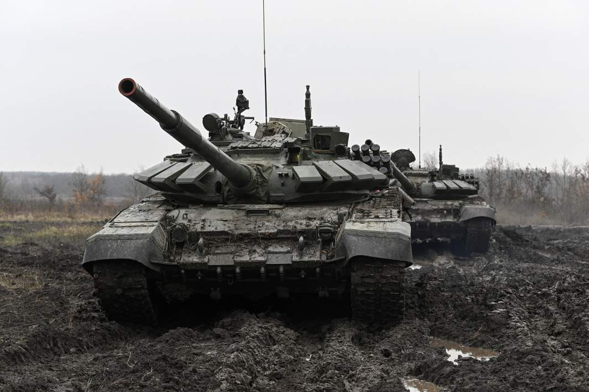

# Глава IV: Священная война

В апреле Россия инициирует экстренное заседание Совета Безопасности ООН, обвиняя западные державы в поддержке нацистских группировок на Украине, финансировании террористических атак в крупных городах России и Китая, эскалации локальных конфликтов, в том числе по Тайваню, а также в подрыве глобальной экономики через санкции против Китая.

Министерство иностранных дел РФ представило список из 50 высокопрофильных лиц, замешанных в указанных действиях. В этот список вошли ключевые военные и государственные деятели США, Франции, Великобритании и других стран НАТО. Россия предложила передать каждого из этих лиц в Международный суд в Гааге, однако США и Франция наложили вето на данное предложение, после чего Россия объявила о своём выходе из состава ООН.

Разведка НАТО зафиксировала значительное наращивание военных сил ОДКБ и АТП на границе, что, по мнению ЦРУ, свидетельствовало о подготовке к военному вторжению, вызвав тревогу в НАТО. Европейский Союз объявил мобилизацию, но не успел создать новые армейские формирования: Китай нанес массовые ракетные удары по Тайваню — члену НАТО, ознаменовав начало войны.