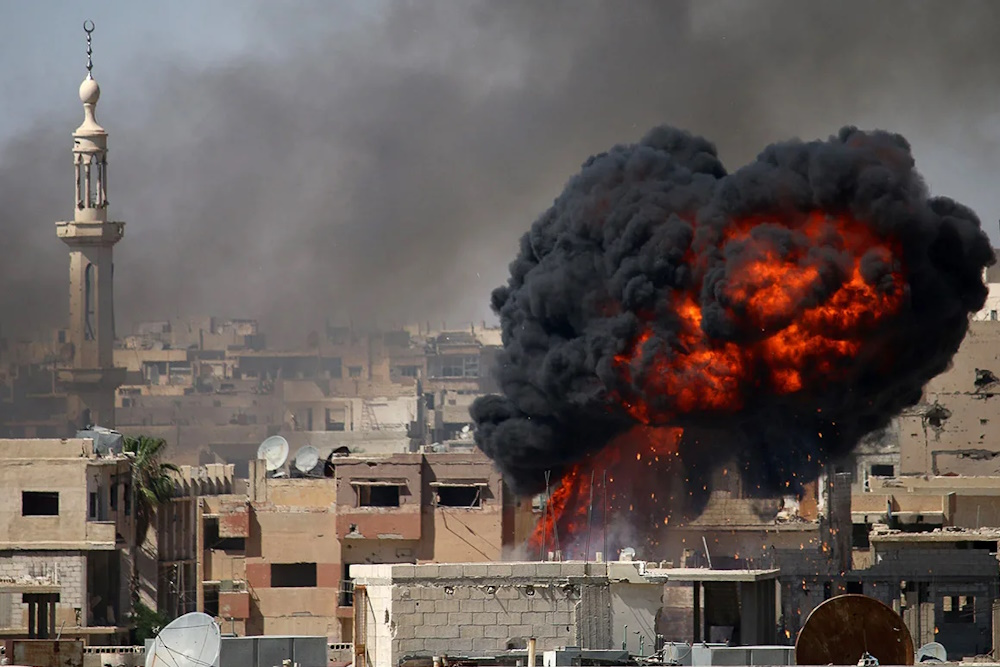

# Ближневосточный фронт

## Превентивный удар

С 2024 года Израиль проводил операцию "Стрелы Севера" по борьбе с ливанской военизированной организацией "Хезболла". Иран и арабские союзники готовились помочь Ливану, но опасались поражения из-за хорошей военной подготовки ЦАХАЛа.

В 2025 году грянула Треться Мировая, и США пришлось сократить поддержку Израился. Иран, Египет, Ливан, Сирия, Иордания и Ирак сформировали негласную коалицию и посчитали это лучшим моментом, чтобы вторгнуться в Израиль. Иран, как участник союза [Москва-Пекин-Тегеран](https://docs.arussianday.ru/story/third-chapter.html#глава-iii-начало-конца), получал финансовую и военную поддержку. Началась ускоренная подготовка к конфликту, о которой израильская внешняя разведка узнала практически сразу.

23 апреля Израильские ВВС и ракетные подразделения нанесли удары по военным складам, базам и центрам принятия решений, временно нейтрализовав генеральные штабы врага. Сухопутные войска ЦАХАЛ перешли в агрессивное наступление на территории Ливана, Сирии и Египта.

## Позиционная война

Израиль ожидал повторения успеха Войны Судного дня, но через несколько дней ситуация вышла из-под контроля. Коалиция оказалась куда лучше подготовлена, и наступление на всех трёх направлениях захлебнулось. Война хаотичная сменилась войной позиционной. В течение нескольких лет Израиль отражал атаки Коалиции и незначительно продвигался в избираемых участках.

Как и с войной в секторе Газа, Израиль предпринимал многочисленные попытки ликвидировать высшие чины Коалиции. Под удар в основном попадали военачальники, главы разведок и сами лидеры стран. Однако за годы войны наблюдалось лишь несколько успешных операций такого типа.

За весь ход войны до конца 2027 года ЦАХАЛ смогли занять юг Ливана, незначительно продвинуться в районе Голанских высот и Синайского полуострова.

## Непрочный мир

Выхода из патовой ситуации не было. Израиль продолжал массированные обстрелы и затратные продвижения, при которых потери никак не оправдывали приобретенные территории. Иран и союзники собирались не сдаваться и давить Израиль до конца, так как рано или поздно у него должно закончиться вооружение или люди. 

Через посредников между воюющими сторонами был найден единственный верный компромисс - заморозка конфликта в статусе-кво.
